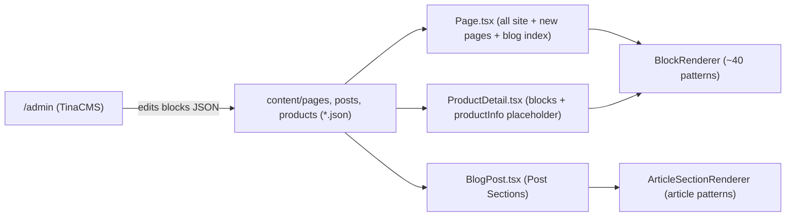

# Blade & Quill: Patterns Everywhere

All work happens in `/Users/nickthrockmorton/cBsites/blade-quill-art-academy/artifacts/blade-quill` (not the currently open NJT26 workspace — you may want to open that folder, but I can work with absolute paths either way).

## What already works (no changes needed)

Every CMS-managed page — Home, Shop, Gallery, Downloads, Education, Publishers, About, Contact, Important Links, and all client-created New Pages — already uses the Tina `blocks` ("Page Sections") list with `visualSelector`, which gives add (+), delete (trash), and drag-to-reorder in `/admin`. Blog posts have the same for "Post Sections". If the client hit a wall, it was on the pages below.

```566:576:/Users/nickthrockmorton/cBsites/blade-quill-art-academy/artifacts/blade-quill/tina/config.ts
  {
    type: "object",
    name: "blocks",
    label: "Page Sections",
    list: true,
    ui: { visualSelector: true, ... },
    templates: ALL_BLOCKS,
  },
```

## Gap 1: Product detail pages (`/shop/:id`) — the biggest one

`src/pages/ProductDetail.tsx` (1,091 lines) is a fixed layout; the client cannot add or reorder anything on a product page.

- Add a `blocks` ("Page Sections") field to the `shopProduct` collection in [tina/config.ts](/Users/nickthrockmorton/cBsites/blade-quill-art-academy/artifacts/blade-quill/tina/config.ts), using `ALL_BLOCKS` plus one new product-only block: **"Product Info"** (`productInfo`), a placeholder that renders the existing purchase UI (gallery, price, add-to-cart, tabs).
- In `ProductDetail.tsx`, render the block list through the existing `BlockRenderer`; when the renderer hits the `productInfo` block it renders the current fixed purchase layout. This makes the purchase section itself reorderable with other patterns, matching "reorderable with other sections."
- Safeguard: if a product has no `blocks` or the list lacks `productInfo`, render the purchase UI at the top as today — so nothing breaks for existing products and the client can never accidentally lose the buy button.
- Update the product GraphQL query/static JSON handling so `blocks` flows through (Tina content only; the Supabase product fallback keeps the fixed layout).

## Gap 2: Blog index (`/blog`)

`src/pages/BlogList.tsx` is a hardcoded shell (heading, tag filter, post grid).

- Extract the current post-grid-with-tag-filter UI into a new **"Blog Index"** block (`blogIndex`) in [tina/blocks.ts](/Users/nickthrockmorton/cBsites/blade-quill-art-academy/artifacts/blade-quill/tina/blocks.ts) and register it in `BlockRenderer` and `ALL_BLOCKS` (so it can also be dropped on any other page).
- Create `content/pages/blog.json` as a protected Site Page with default sections: `pageHeader` ("Blog" heading + intro) + `blogIndex`.
- Route `/blog` through the existing `Page.tsx` composer in [src/App.tsx](/Users/nickthrockmorton/cBsites/blade-quill-art-academy/artifacts/blade-quill/src/App.tsx), replacing `BlogList`.
- Result: the client can add patterns above/below the post grid (CTA band, newsletter signup, featured release, etc.) and reorder them.

## Deliberately kept fixed (with rationale, flagged to client)

- **Cart / Order success**: transactional pages; checkout-adjacent legal requirements (see her legal checklist) argue against freeform editing. Can add an optional "Extra Sections below cart" list later if she asks.
- **Legal pages**: markdown documents, should stay canonical.
- **Blog Post Sections** stay their own curated article set (heading, text, image, callout, spacer, divider) — already fully add/delete/reorderable. Mixing full-width page heroes into a narrow article column would break layouts; if she wants specific patterns (e.g. CTA band, newsletter signup) inside posts, those can be added to the blog set as a follow-up.

## Wiring / verification

- Regenerate Tina types and the admin build after schema changes (`pnpm tina` dev/build per repo scripts).
- Seed `blocks: [{ "_template": "productInfo" }]` into existing product JSON so the editor shows the purchase section as a reorderable card from day one.
- Verify in `/admin`: add/delete/drag sections on a product page and the blog page; confirm the public routes render, including the no-blocks fallback and the Supabase-fallback product path.
- Update `docs/EDITING-GUIDE.md` with a short note on the new editable surfaces.

## Architecture after the change

