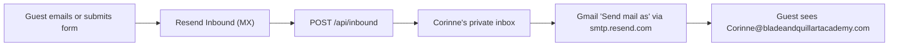

# Email Reply Privacy — Blade & Quill Art Academy

Saved plan for keeping Corinne's personal email address hidden when she replies to contact form submissions. Re-read this when resuming email work.

## The problem

The contact form emails Corinne via Resend, and those notifications come from `CONTACT_FROM_EMAIL` (currently `onboarding@resend.dev`). But when Corinne hits **Reply** in her email client, Resend is not involved anymore — the reply is sent by her personal mailbox, so the guest sees her personal address as the From. No change to the contact form alone can fix this; her mail client needs a branded identity to send from, and the branded address needs somewhere to receive mail.

## The fix (all inside Resend — no new provider, no extra cost)

1. **Receive** mail for `@bladeandquillartacademy.com` with Resend Inbound (one MX record). A webhook ([api/inbound.ts](../api/inbound.ts)) forwards every message to her private inbox.
2. **Send** replies as the branded address from Gmail using "Send mail as" over Resend SMTP (`smtp.resend.com`, authenticated with the Resend API key). Replies get proper SPF/DKIM because the domain is verified in Resend.
3. **Point the contact form at the branded address** (`CONTACT_TO_EMAIL`), so notifications flow through the forwarder and Gmail automatically replies from the branded identity.

## Setup checklist

| Step                                                                                                                                                    | Where                                     | Status   |
| ------------------------------------------------------------------------------------------------------------------------------------------------------- | ----------------------------------------- | -------- |
| 1. Verify `bladeandquillartacademy.com` in Resend (DKIM/SPF TXT records in Vercel DNS)                                                                  | Resend → Domains                          | Not done |
| 2. Enable **Receiving** on the domain and add the inbound MX record shown by Resend to Vercel DNS (safe: the domain has no existing MX records)         | Resend → Domains → Receiving              | Not done |
| 3. Create a webhook for event `email.received` pointing at the inbound endpoint (URL below)                                                             | Resend → Webhooks                         | Not done |
| 4. Add `RESEND_WEBHOOK_SECRET` (the webhook's signing secret) and `INBOUND_FORWARD_TO_EMAIL` (her private inbox) to Vercel env, redeploy                | Vercel → Settings → Environment Variables | Not done |
| 5. Test: email `Corinne@bladeandquillartacademy.com` from any account; it should arrive in her private inbox                                            | —                                         | Not done |
| 6. Gmail "Send mail as" (steps below)                                                                                                                   | Her Gmail settings                        | Not done |
| 7. Switch `CONTACT_TO_EMAIL` to `Corinne@bladeandquillartacademy.com` and `CONTACT_FROM_EMAIL` to `Blade & Quill <contact@bladeandquillartacademy.com>` | Vercel env                                | Not done |
| 8. End-to-end test: submit the contact form, reply from Gmail, confirm the guest-side From is the branded address                                       | —                                         | Not done |

## Webhook URL

**Endpoint:** `https://blade-quill-art-academy.vercel.app/api/inbound`

Do **not** use `bladeandquillartacademy.com` for API routes until launch — `vercel.json` rewrites that domain to the under-construction page (including `/api/*`). After launch the webhook URL can stay on the `vercel.app` host (it serves the same deployment) or be switched to the apex domain.

## Gmail "Send mail as" setup (step 6)

> **The alias address must be on the branded domain.** Resend only sends from
> domains verified in the account, so a "Send mail as" alias for a Yahoo,
> Gmail, or any other third-party address bounces with
> `550 The <domain> is not verified`. The alias is
> `Corinne@bladeandquillartacademy.com` — never her personal address.

1. In Resend, create a **second API key** named e.g. "Gmail SMTP" with **Sending access** only (don't reuse the server key; this one lives in Gmail).
2. Gmail → Settings (gear) → **See all settings** → **Accounts and Import** → "Send mail as" → **Add another email address**.
3. Name: `Corinne — Blade & Quill Art Academy`. Email: `Corinne@bladeandquillartacademy.com`. Uncheck "Treat as an alias".
4. SMTP server: `smtp.resend.com`, port `465`, username: the literal word `resend`, password: the Gmail SMTP API key, secured with SSL.
5. Gmail emails a verification code to the branded address — it arrives in her inbox via the inbound forwarder (steps 1–5 must be done first).
6. Back in "Send mail as", set **"When replying to a message: Reply from the same address the message was sent to"**. Because contact notifications are addressed to the branded alias (step 7), replies then default to the branded From with no manual dropdown selection.

## Troubleshooting

| Symptom                                                                                | Cause                                                                                                                                                                            | Fix                                                                                                                                                                                                                                         |
| -------------------------------------------------------------------------------------- | -------------------------------------------------------------------------------------------------------------------------------------------------------------------------------- | ------------------------------------------------------------------------------------------------------------------------------------------------------------------------------------------------------------------------------------------- |
| Bounce: `550 The yahoo.com domain is not verified. Please, add and verify your domain` | The "Send mail as" alias was created for a personal address (Yahoo/Gmail/etc.) instead of the branded one. Resend refuses to send from domains the account doesn't own.          | Delete that alias in Gmail → Accounts and Import → "Send mail as", and create it again with `Corinne@bladeandquillartacademy.com`. (A bounce like this also confirms the SMTP server/username/password are correct — Gmail reached Resend.) |
| Bounce: `550 The bladeandquillartacademy.com domain is not verified`                   | The branded domain itself isn't verified in Resend yet (checklist step 1).                                                                                                       | Resend → Domains → add `bladeandquillartacademy.com` and add the DKIM/SPF records it shows to Vercel DNS; wait for "Verified".                                                                                                              |
| Gmail's alias verification code never arrives                                          | Inbound forwarding isn't live yet — the branded address has no way to receive mail until checklist steps 2–5 are done and the `/api/inbound` function is deployed to production. | Finish steps 1–5 first (this is why Gmail setup is step 6).                                                                                                                                                                                 |
| Corinne has to manually pick the branded From on every reply                           | Contact notifications are still addressed to her personal inbox, and/or the reply-from setting is off.                                                                           | Complete step 7 (`CONTACT_TO_EMAIL` → branded address) and enable "When replying to a message: Reply from the same address the message was sent to" in Gmail → Accounts and Import. Both are needed for automatic branded replies.          |

## Caveats

- **Google is retiring third-party "Send mail as" in January 2027.** The long-term replacement is a Google Workspace account on the domain (which also replaces the inbound forwarding). This setup works now and buys time without new subscriptions; revisit before 2027.
- Until the domain is verified in Resend (step 1), nothing here works — Resend only delivers `onboarding@resend.dev` mail to the account owner.
- The inbound MX record receives mail for **every** address at the domain (`contact@`, `Corinne@`, anything). [api/inbound.ts](../api/inbound.ts) forwards all of it to `INBOUND_FORWARD_TO_EMAIL`.
- The forwarded email's From must be on the verified domain (Resend/DMARC requirement), so the forward uses `CONTACT_FROM_EMAIL`; the original sender is preserved in the message and replying in Gmail goes to them.

**Key files:**

- [api/inbound.ts](../api/inbound.ts) — inbound webhook, verifies signature and forwards
- [api/contact.ts](../api/contact.ts) — contact form notification (unchanged flow, env-driven)
- [artifacts/blade-quill/DEPLOY.md](../artifacts/blade-quill/DEPLOY.md) — env var table and deploy notes
