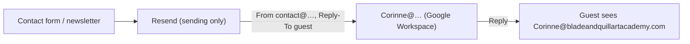

# Business Email & Reply Privacy — Blade & Quill Art Academy

How mail for `bladeandquillartacademy.com` works, and how Corinne's personal address stays hidden when she replies to contact form submissions. Re-read this when resuming email work.

## Current setup (Google Workspace + Resend sending)

Corinne has a real Google Workspace mailbox, **`Corinne@bladeandquillartacademy.com`** (Vercel DNS: `MX 1 smtp.google.com`, added Sep 2026). That mailbox is where she reads and answers mail, so replies naturally come from the business address — no forwarding or "Send mail as" tricks are needed.

Resend is only used to **send**: contact form notifications (`api/contact.ts`) and newsletter confirmations (`api/newsletter.ts`) go out as `Blade & Quill Art Academy <contact@bladeandquillartacademy.com>` and are delivered to her Google inbox.

```mermaid
flowchart LR
    Form[Contact form / newsletter] --> Resend["Resend (sending only)"]
    Resend -->|"From contact@…, Reply-To guest"| Inbox["Corinne@… (Google Workspace)"]
    Inbox -->|Reply| Guest["Guest sees Corinne@bladeandquillartacademy.com"]
```

### Setup: `~/resend-setup.sh`

Run `bash ~/resend-setup.sh` (interactive; asks for the Resend API key with hidden input, safe to re-run). It:

1. Adds `bladeandquillartacademy.com` to Resend (sending only).
2. Adds Resend's DKIM/SPF records to Vercel DNS — all on the `send` and `_domainkey` subdomains, so Google's apex MX is untouched.
3. Waits for Resend to report the domain **verified**.
4. Sets Vercel Production `CONTACT_TO_EMAIL=Corinne@bladeandquillartacademy.com` and `CONTACT_FROM_EMAIL=Blade & Quill Art Academy <contact@bladeandquillartacademy.com>`.
5. Redeploys the current production build and sends a test message through `/api/contact`.

### Rules of the road

- **Never enable "Receiving" on the domain in Resend or add its inbound MX record.** The apex MX belongs to Google Workspace; a second MX would steal or bounce her mail.
- Resend's records live on `send.bladeandquillartacademy.com` (MX + SPF TXT) and `*._domainkey` — they do not conflict with Google's SPF/DKIM on the apex.
- Recommended follow-ups in Vercel DNS once Google Workspace setup finishes (Google's admin wizard shows the exact values): apex `TXT v=spf1 include:_spf.google.com ~all`, Google's DKIM key, and `_dmarc TXT v=DMARC1; p=none;`. Only one SPF record may exist on the apex.
- `RESEND_WEBHOOK_SECRET` / `INBOUND_FORWARD_TO_EMAIL` are **not needed**; [api/inbound.ts](../api/inbound.ts) is unused unless the mailbox setup changes.

## Troubleshooting

| Symptom                                                                  | Cause                                                                                   | Fix                                                                                                                       |
| ------------------------------------------------------------------------ | --------------------------------------------------------------------------------------- | ------------------------------------------------------------------------------------------------------------------------- |
| Contact form returns 500; logs show `domain is not verified`             | `bladeandquillartacademy.com` isn't verified in Resend, or `CONTACT_FROM_EMAIL` uses it anyway | Re-run `~/resend-setup.sh`; check Resend → Domains for record status.                                                     |
| Test email never arrives                                                 | Google Workspace mailbox not finished (MX just added), or message in spam               | Confirm the mailbox receives mail from any other account first; check spam the first time.                                |
| Corinne's reply shows a personal address                                 | She replied from a personal account instead of the Workspace mailbox                    | Reply from `Corinne@bladeandquillartacademy.com` in Gmail (or add the Workspace account to her mail app).                   |
| Corinne's outgoing mail lands in spam                                    | Google's SPF/DKIM records not yet added on the apex                                      | Finish Google's "Authenticate email" steps in the Workspace admin console and add the records to Vercel DNS.               |

## Superseded plan (kept for reference)

Before the Google Workspace mailbox existed, the plan was to fake a branded inbox with Resend: enable **Receiving** on the domain (inbound MX record), have an `email.received` webhook ([api/inbound.ts](../api/inbound.ts)) forward every message to her personal inbox, and use Gmail "Send mail as" over `smtp.resend.com` so replies came from the branded address. Env vars `RESEND_WEBHOOK_SECRET` and `INBOUND_FORWARD_TO_EMAIL` belonged to that plan.

It was never turned on, and it must not be now: its MX record would conflict with Google's, and Google is retiring third-party "Send mail as" in January 2027 anyway. The Workspace mailbox is the long-term answer.

**Key files:**

- `~/resend-setup.sh` (Nick's machine) — one-shot Resend domain + Vercel env setup
- [api/contact.ts](../api/contact.ts) — contact form notification (env-driven)
- [api/newsletter.ts](../api/newsletter.ts) — newsletter confirmation, also sent from `CONTACT_FROM_EMAIL`
- [api/inbound.ts](../api/inbound.ts) — unused inbound webhook from the superseded plan
- [artifacts/blade-quill/DEPLOY.md](../artifacts/blade-quill/DEPLOY.md) — env var table and deploy notes
