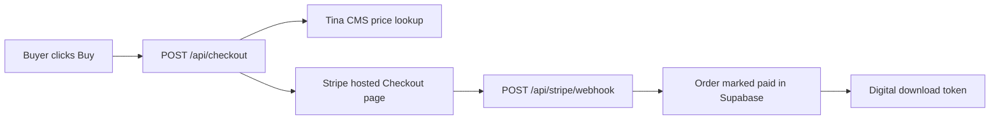

# Stripe Integration Plan — Blade & Quill Art Academy

Saved plan for connecting Corinne's Stripe account to the shop. Re-read this when resuming Stripe work.

## Status (as of 2026-09-06)

| Step | Status |
|------|--------|
| Stripe integration code | Done (already in repo) |
| Test secret key in local `.env` | Done — verified against sandbox account `acct_1TxZJmBnU4n0Y9R1` ("Blade and Quill Website sandbox") |
| Test webhook endpoint created | Done (`we_1Txe8QBnU4n0Y9R1iOF9NvDh`, enabled, correct events) |
| Webhook signing secret in local `.env` | Done |
| `STRIPE_SECRET_KEY` on Vercel Production | Done |
| `STRIPE_WEBHOOK_SECRET` on Vercel Production | Done |
| Production redeploy | Done |
| Production `POST /api/checkout` creates a Stripe test session | Verified 2026-09-04 (`cs_test_...`, $14.99, correct metadata) |
| Smoke test (`pnpm --filter @workspace/scripts run test:checkout`) | Passes 2026-09-06 (`TINA_OK`, `SCHEMA_OK`, `STRIPE_OK`) |
| Production `POST /api/checkout` writes `pending` order row | Verified 2026-09-06 (order #6) |
| End-to-end test purchase (4242 card) | Done 2026-09-06 — order #7 `paid`, email captured, success page rendered |
| Webhook signature verification | **Was broken** (every real event 400'd); fixed 2026-09-06, see below |
| Digital download delivery | Code + private bucket ready 2026-09-06; **needs the PDF uploaded + `downloadUrl` set in Tina** |
| Go live (live keys + live webhook) | **Not done yet** |

### Supabase incident (resolved 2026-09-06)

The Supabase project was paused for inactivity (free tier, 7 days idle); paused projects' hostnames stop resolving, so checkout 500'd at `insertPendingOrder`. Restored via the dashboard on 2026-09-06 (~3 min: DNS → 521 → 404 → PGRST002 schema cache → 200). Data intact, no schema re-apply needed. A daily keep-alive ping is being added separately so it doesn't pause again.

**Hardening done 2026-09-06:** `createCheckoutSession` now expires the Stripe session if the pending-order insert fails (previously it left an orphaned `open` session and returned a 500). Verified live against the paused host: session → `expired`, clean 500. In `lib/checkout/src/index.ts`; not yet committed/deployed.

### Webhook was silently failing (fixed 2026-09-06)

During the test purchase, `POST /api/stripe/webhook` returned 400 twice (Stripe retry). Diagnosis: Vercel's Node request helpers pre-parse JSON into `req.body` regardless of `config.api.bodyParser = false`; `readRawBody` then re-serialized it with `JSON.stringify`, dropping the pretty-print whitespace Stripe signs over → `No signatures found matching`. Confirmed by sending a signed compact payload (200) vs. a signed pretty-printed payload (400) with the same secret. Order #7 was still marked paid because the success page's `getOrderSuccess` also calls `fulfillOrder` — a safety net, not the primary path.

Fix: `api/stripe/webhook.ts` now uses the Web-standard handler (`export async function POST(request: Request)`) and `await request.text()`, which is guaranteed to be the raw bytes.

**Same bug likely affects `api/inbound.ts` (Resend webhook) via the shared `readRawBody`.** Not fixed here — separate feature.

### Digital downloads (built 2026-09-06)

Decision: buyers download directly from the success page; no Gumroad hand-off.

- Private Supabase Storage bucket **`product-downloads`** created (50 MB/object cap, PDF/ZIP/EPUB only). Public URLs are rejected; only signed URLs work.
- `resolveDownloadRedirect` (`lib/checkout/src/index.ts`): if `download_url` is a bare filename, it's exchanged for a 60-second signed URL with `download=<filename>` (forces a save dialog). `https://…` and `/files/…` values still pass through unchanged. Bucket name overridable via `DOWNLOADS_BUCKET` env.
- `OrderSuccess.tsx`: primary button is now **"Download Now"** (`<a href download>`), Gumroad fallback removed. If no `downloadUrl`, shows a "contact us" message instead.
- Follow-up: update the Tina **Download URL** field hint (`tina/config.ts` ~line 935) to describe the bucket workflow the next time `build:deploy` is run — changing `config.ts` requires regenerating `tina-lock.json`/`__generated__`, so it wasn't bundled with this fix.
- Verified end to end with a stand-in PDF: upload → signed URL → 200 `application/pdf`, `Content-Disposition: attachment` → expired token → 410. Stand-in removed afterwards.

**Remaining manual step:** upload the real *Krita Quick Start Guide (2nd Edition)* PDF to Supabase Storage → `product-downloads`, then in Tina Shop Products set **Download URL** to its filename (e.g. `krita-quick-start-guide-2e.pdf`). Physical books don't need this.

## API keys Corinne needs

Only **two** Stripe credentials are used by this site:

| Key | Env var | Where to get it |
|-----|---------|-----------------|
| Secret key | `STRIPE_SECRET_KEY` | Stripe Dashboard → Developers → API keys |
| Webhook signing secret | `STRIPE_WEBHOOK_SECRET` | Stripe Dashboard → Developers → Webhooks → endpoint → Signing secret |

**Not used:** publishable key (`pk_...`) — checkout is server-side Stripe Checkout Sessions; nothing loads Stripe.js in the browser.

**Also required** (already configured): `SUPABASE_URL`, `SUPABASE_SERVICE_ROLE_KEY`, `TINA_PUBLIC_CLIENT_ID`, `TINA_TOKEN`.

## How it works



- Product prices are edited in Tina (`/admin` → Shop Products), not in Stripe.
- Checkout creates a Stripe Session with inline `price_data` from Tina.
- Webhook events: `checkout.session.completed`, `checkout.session.async_payment_succeeded`.

**Key files:**
- [lib/checkout/src/index.ts](../lib/checkout/src/index.ts)
- [api/checkout.ts](../api/checkout.ts)
- [api/stripe/webhook.ts](../api/stripe/webhook.ts)
- [lib/db/sql/schema.sql](../lib/db/sql/schema.sql)
- [artifacts/blade-quill/DEPLOY.md](../artifacts/blade-quill/DEPLOY.md)

## Webhook URL

**Test mode endpoint:** `https://blade-quill-art-academy.vercel.app/api/stripe/webhook`

Do **not** use `bladeandquillartacademy.com` for API routes until launch — `vercel.json` rewrites that domain to the under-construction page (including `/api/*`).

## Remaining steps

### 1. Test purchase (test mode)

1. Open `https://blade-quill-art-academy.vercel.app/shop`
2. Buy a product with test card `4242 4242 4242 4242`
3. Confirm:
   - Redirect to success page
   - Order status → paid in Supabase `orders` table
   - Digital products get a working download link
   - Sale appears in Owner Insights (`/insights`)

### 2. Go live

1. Complete Stripe business/bank verification in Corinne's account
2. Toggle Stripe to **Live mode**
3. Copy live secret key → update `STRIPE_SECRET_KEY` in Vercel Production (and `.env`)
4. Create a **new** live-mode webhook at the same URL (live and test signing secrets differ)
5. Copy live signing secret → update `STRIPE_WEBHOOK_SECRET` in Vercel
6. Redeploy: `vercel deploy --prod` or push to `main`
7. Make one small real purchase, then refund in Stripe Dashboard

## Ongoing workflow for Corinne

- Change product name, price, stock, download URL in Tina only
- Use Stripe Dashboard for payouts, refunds, and disputes only

## Known gaps (optional follow-ups)

- Cart checks out one line item at a time (not multi-item Stripe cart)
- Workshop/class pages still CTA to `/contact` — make them purchasable by adding Tina Shop Products and wiring CTAs to checkout

## Verify locally

```bash
pnpm --filter @workspace/scripts run test:checkout
```

Expect `TINA_OK`, `SCHEMA_OK`, `STRIPE_OK`.
