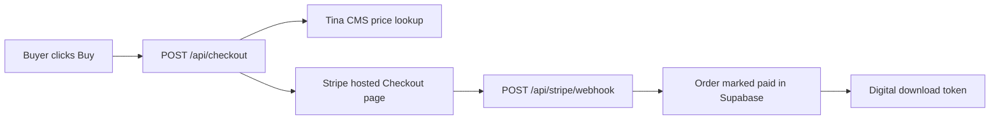

# Stripe Integration Plan — Blade & Quill Art Academy

Saved plan for connecting Corinne's Stripe account to the shop. Re-read this when resuming Stripe work.

## Status (as of 2026-07-27)

| Step | Status |
|------|--------|
| Stripe integration code | Done (already in repo) |
| Test secret key in local `.env` | Done |
| Test webhook endpoint created | Done (`we_1Txe8QBnU4n0Y9R1iOF9NvDh`) |
| Webhook signing secret in local `.env` | Done |
| `STRIPE_SECRET_KEY` on Vercel Production | Done |
| `STRIPE_WEBHOOK_SECRET` on Vercel Production | Done |
| Production redeploy | Done |
| Smoke test (`pnpm --filter @workspace/scripts run test:checkout`) | Passes (`TINA_OK`, `SCHEMA_OK`, `STRIPE_OK`) |
| End-to-end test purchase (4242 card) | **Not done yet** |
| Go live (live keys + live webhook) | **Not done yet** |

## API keys Corinne needs

Only **two** Stripe credentials are used by this site:

| Key | Env var | Where to get it |
|-----|---------|-----------------|
| Secret key | `STRIPE_SECRET_KEY` | Stripe Dashboard → Developers → API keys |
| Webhook signing secret | `STRIPE_WEBHOOK_SECRET` | Stripe Dashboard → Developers → Webhooks → endpoint → Signing secret |

**Not used:** publishable key (`pk_...`) — checkout is server-side Stripe Checkout Sessions; nothing loads Stripe.js in the browser.

**Also required** (already configured): `SUPABASE_URL`, `SUPABASE_SERVICE_ROLE_KEY`, `TINA_PUBLIC_CLIENT_ID`, `TINA_TOKEN`.

## How it works



- Product prices are edited in Tina (`/admin` → Shop Products), not in Stripe.
- Checkout creates a Stripe Session with inline `price_data` from Tina.
- Webhook events: `checkout.session.completed`, `checkout.session.async_payment_succeeded`.

**Key files:**
- [lib/checkout/src/index.ts](../lib/checkout/src/index.ts)
- [api/checkout.ts](../api/checkout.ts)
- [api/stripe/webhook.ts](../api/stripe/webhook.ts)
- [lib/db/sql/schema.sql](../lib/db/sql/schema.sql)
- [artifacts/blade-quill/DEPLOY.md](../artifacts/blade-quill/DEPLOY.md)

## Webhook URL

**Test mode endpoint:** `https://blade-quill-art-academy.vercel.app/api/stripe/webhook`

Do **not** use `bladeandquillartacademy.com` for API routes until launch — `vercel.json` rewrites that domain to the under-construction page (including `/api/*`).

## Remaining steps

### 1. Test purchase (test mode)

1. Open `https://blade-quill-art-academy.vercel.app/shop`
2. Buy a product with test card `4242 4242 4242 4242`
3. Confirm:
   - Redirect to success page
   - Order status → paid in Supabase `orders` table
   - Digital products get a working download link
   - Sale appears in Owner Insights (`/insights`)

### 2. Go live

1. Complete Stripe business/bank verification in Corinne's account
2. Toggle Stripe to **Live mode**
3. Copy live secret key → update `STRIPE_SECRET_KEY` in Vercel Production (and `.env`)
4. Create a **new** live-mode webhook at the same URL (live and test signing secrets differ)
5. Copy live signing secret → update `STRIPE_WEBHOOK_SECRET` in Vercel
6. Redeploy: `vercel deploy --prod` or push to `main`
7. Make one small real purchase, then refund in Stripe Dashboard

## Ongoing workflow for Corinne

- Change product name, price, stock, download URL in Tina only
- Use Stripe Dashboard for payouts, refunds, and disputes only

## Known gaps (optional follow-ups)

- Cart checks out one line item at a time (not multi-item Stripe cart)
- Workshop/class pages still CTA to `/contact` — make them purchasable by adding Tina Shop Products and wiring CTAs to checkout

## Verify locally

```bash
pnpm --filter @workspace/scripts run test:checkout
```

Expect `TINA_OK`, `SCHEMA_OK`, `STRIPE_OK`.
